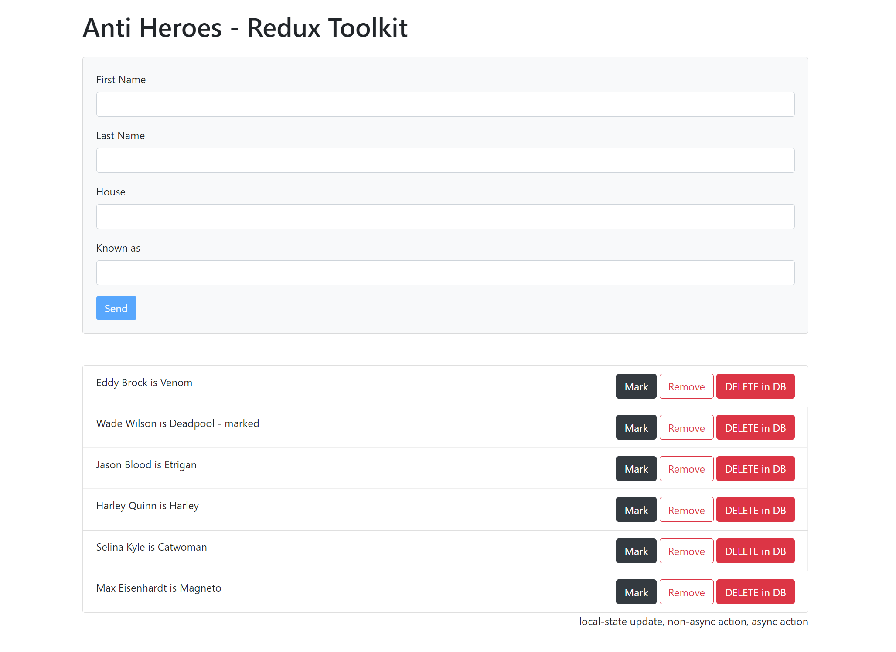

## React TypeScript Redux with Thunk, Saga, and Redux Toolkit

#### Precomit hookis setup

https://dev.to/juliang/configuring-prettier-and-typescript-compiler-as-a-pre-commit-hook-44jh

### To run the project after cloning

Create or go to your demo directory then run the following in the terminal or cmd.

```sh
$ git clone https://github.com/webmasterdevlin/heroes-redux-typescript.git
$ cd heroes-redux-typescript
$ npm install
$ npm run start
```

The React app and the fake web service will run concurrently.


